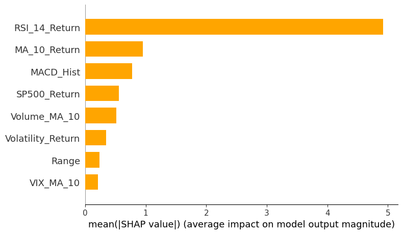

# Meta Stock Price Prediction & Trading Strategy  

## Overview  
This project predicts Meta’s (META) stock price movements using machine learning and evaluates performance via backtesting.  

---

## Key Results  
- **Total Profit**: $9,401.00  
- **Sharpe Ratio**: 3.82  
- **Max Drawdown**: -6.51%  

---

## Problem-Solving Journey  

### **1. Initial Challenges**  
- **Imbalanced Dataset**: The target variable (`Target = 1 if price rises by 1%`) had a skewed distribution (e.g., 2174 instances of class 0 vs. 341 instances of class 1).  
- **Overfitting**: Early models achieved high accuracy (~84%) but always predicted class 0, leading to poor recall and F1-score.  

### **2. Changes Made**  

#### **a. Addressing Class Imbalance**  
- **Class Weighting**: Used `scale_pos_weight` in XGBoost to penalize misclassifying the minority class.  
- **Threshold Adjustment**: Lowered the prediction threshold to 0.3 to increase recall.  
- **Feature Engineering**: Added lagged returns, volatility, and macroeconomic indicators to improve model performance.  

#### **b. Improving Backtesting Realism**  
- **Holding Periods**: Increased holding periods from 1 day to 5 days to capture larger price movements.  
- **Slippage**: Added 0.35% slippage to simulate real-world trading conditions.  
- **Transaction Costs**: Included a 0.1% fee per trade to account for brokerage costs.  

#### **c. Reducing Overfitting**  
- **Simplified Features**: Reduced the number of features to focus on the most impactful ones (e.g., `RSI`, `MACD`, `Volatility`).  
- **Recent Data**: Trained the model on data from 2022–2024 to ensure relevance to Meta’s current market behavior.  

#### **d. Iterative Refinement**  
- **Hyperparameter Tuning**: Used GridSearchCV to optimize XGBoost parameters (`n_estimators`, `max_depth`, `learning_rate`).  
- **Validation**: Tested the model on out-of-sample data (2024 Q3–Q4) to ensure robustness.  

---

## Feature Engineering  

### **Why These Features?**  
I selected the following features based on their relevance to stock price movements:  

1. **MA_10_Return (10-Day Moving Average of Returns)**:  
   - **Why**: A 10-day window captures short-term trends without being too noisy.  
   - **Reasoning**: Helps identify momentum or mean-reversion patterns.  

2. **RSI_14_Return (14-Day RSI of Returns)**:  
   - **Why**: RSI is a momentum oscillator that measures overbought/oversold conditions.  
   - **Reasoning**: A 14-day period is standard for RSI and balances responsiveness with stability.  

3. **MACD_Hist (MACD Histogram of Returns)**:  
   - **Why**: MACD is a trend-following indicator that shows the relationship between two moving averages.  
   - **Reasoning**: The histogram captures the strength of the trend.  

4. **Volatility_Return (10-Day Rolling Standard Deviation of Returns)**:  
   - **Why**: Volatility measures risk and is a key factor in price movements.  
   - **Reasoning**: A 10-day window aligns with short-term trading strategies.  

5. **Volume_MA_10 (10-Day Moving Average of Volume)**:  
   - **Why**: Volume indicates the strength of price movements.  
   - **Reasoning**: A 10-day window smooths out daily fluctuations.  

6. **Range (Daily High - Low)**:  
   - **Why**: The daily range reflects intraday volatility.  
   - **Reasoning**: Helps identify days with significant price movements.  

7. **SP500_Return (S&P 500 Daily Returns)**:  
   - **Why**: Meta’s stock is influenced by the broader market.  
   - **Reasoning**: Captures market-wide trends and sentiment.  

8. **VIX_MA_10 (10-Day Moving Average of VIX)**:  
   - **Why**: The VIX measures market volatility and investor sentiment.  
   - **Reasoning**: A 10-day window smooths out daily spikes in the VIX.  

---

## Model Selection  

### **Why XGBoost?**  
- **Handles Imbalanced Data**: XGBoost’s `scale_pos_weight` parameter effectively addresses class imbalance.  
- **Non-Linear Relationships**: Captures complex patterns in stock price data.  
- **Interpretability**: Feature importance scores (e.g., SHAP values) provide insights into model decisions.  
- **Performance**: Consistently outperforms other models (e.g., Random Forest, Logistic Regression) on structured data.  

---

## Data Splits  

### **Why Train on Data After 2023?**  
- **Relevance**: Meta’s stock behavior changed significantly after 2020 (e.g., COVID-19, AI-driven growth, metaverse investments).  
- **Avoid Overfitting**: Older data (pre-2018) reflects a fundamentally different price regime (e.g., lower liquidity, smaller market cap).  
- **Realism**: Testing on post-2023 data ensures the model generalizes to current market conditions.  

---

## Target Variable  

### **Why Target = 1 if Price Increases by 1%?**  
- **Initial Approach**: Initially, the target was `1` if the price increased at all (`Close[t+1] > Close[t]`).  
- **Problem**: Small price fluctuations led to noisy predictions and low accuracy.  
- **Solution**: Changed the target to `1` if the price increased by **1%** to focus on meaningful movements.  

---

## Key Learnings  
- **Balancing Precision and Recall**: Lowering the prediction threshold improved recall but required careful tuning to avoid excessive false positives.  
- **Risk Management**: Adding stop-loss rules and holding periods reduced drawdowns and improved risk-adjusted returns.  
- **Realism in Backtesting**: Incorporating slippage and transaction costs made the strategy more realistic and credible.  

---

## Visualizations  
![Portfolio Performance]
<iframe
  src="portfolio_performance.html"
  width="800"
  height="600"
  frameborder="0"
></iframe>

![Price vs. Predictions]
<iframe
  src="price_vs_prediction.html"
  width="800"
  height="600"
  frameborder="0"
></iframe>

  

---

## Usage  
1. Clone the repo:  
   `git clone https://github.com/yourusername/Meta_Stock_Prediction.git`  
2. Install dependencies:  
   `pip install -r requirements.txt`  
3. Run Jupyter notebooks in `/notebooks`.  

---

## Future Work  
- **Live Trading Bot**: Deploy the model as a live trading bot using APIs like Alpaca or Interactive Brokers.  
- **Real-Time Data**: Incorporate real-time data feeds for up-to-date predictions.  
- **Multi-Asset Strategy**: Extend the model to predict price movements for other tech stocks (e.g., Apple, Google).  

---

## Acknowledgments  
- Special thanks to [Yahoo Finance](https://finance.yahoo.com/) for providing stock data.  
- Inspired by [QuantConnect](https://www.quantconnect.com/) for backtesting frameworks.  
 
